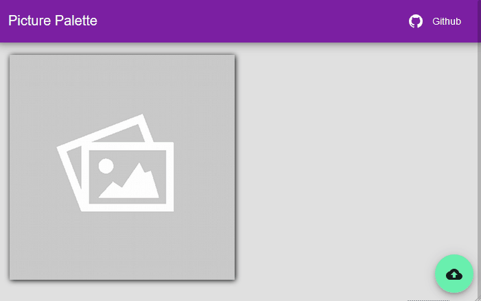

# PicturePalette

User interface consumes [Imagga](https://docs.imagga.com/) color extractor API<br>
Picture palette returns a color graphic charter from local picture file<br>
You can extract colors charter in CSS file

## Live Demo


## Prerequisites

Get a [Imagga](https://imagga.com/) account and copy 'Authorization' key (without 'Basic ' characters)<br>
Add a config.json file in assets directory and past this
```
{
    "token":"KEY_AUTHORIZATION_API"
}
```

## Install
```
$git clone 
$cd PicturePalette
$npm install
```

## Build with

* This project was generated with [Angular CLI](https://github.com/angular/angular-cli) version 6.0.8.

## Development server

Run `npm run serve` for a dev server. Navigate to `http://localhost:4200/`. The app will automatically reload if you change any of the source files.<br>
Run `npm run bserve` for compile in browser.

## Code scaffolding

Run `npm run generate component component-name` to generate a new component. You can also use `ng generate directive|pipe|service|class|guard|interface|enum|module`.

## Build

Run `npm run build` to build the project. The build artifacts will be stored in the `dist/` directory. Use the `--prod` flag for a production build.

## Contributor

- [Cyril Ichti](https://github.com/seeren)

## Authors

Cédric Leguay - *Initial work* - [picture-palette](https://github.com/cedleg/PicturePalette)

## Motivation

Learning to Angular 6

## License

This project is licensed under the MIT License - see the [LICENSE.md](LICENSE.md) file for details.